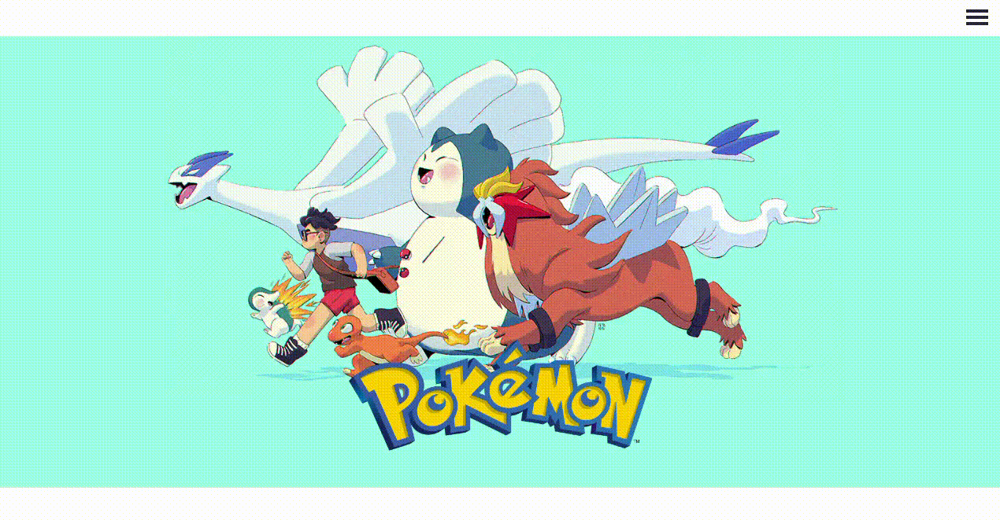
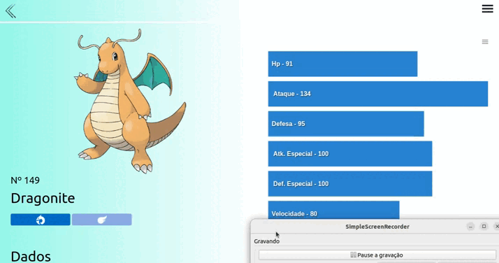
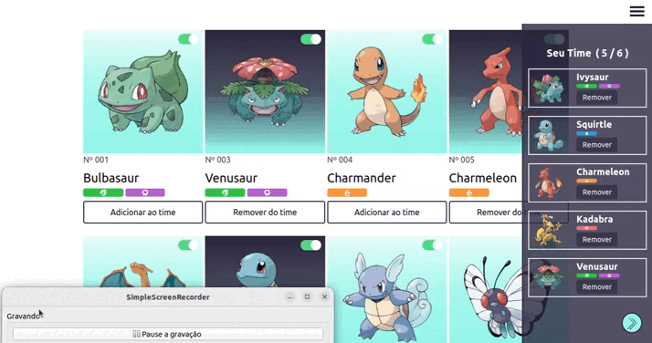
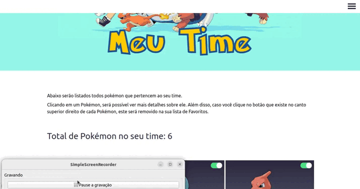
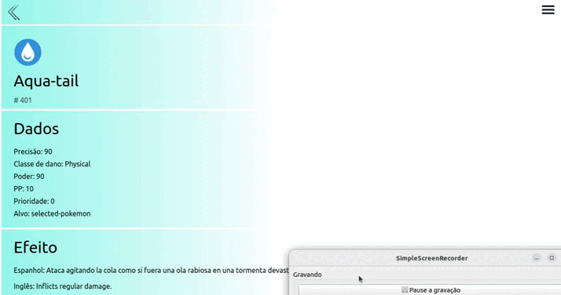

<h1 align="center">Pokédex-React</h1>

Projeto idealizado por Bruno Gabryell Cabral da Silva com o intuito de criar uma aplicação que disponibilize mecanismos de busca por Pokémon e seus Movimentos de maneira interativa e de fácil compreensão!

<h3 align="center">https://brunocabralsilva.github.io/pokedex-react/</h3>

<h2> Índice</h2>

* [Introdução](#intro)
* [Descrição do Projeto](#descrição-do-projeto)
* [Mapeamento do Site](#mapeamento)
* [Tecnologias utilizadas](#tecnologias-utilizadas)
* [Conceitos abordados](#conceitos-abordados)
* [Desenvolvedores](#pessoas-envolvidas)
* [Conclusão](#conclusão)

<h2 id="intro">Introdução</h2>

<strong>Pokémon</strong> é uma franquia originada de jogos eletrônicos desenvolvidos pela Game Freak e publicados pela Nintendo. Lançado pela primeira vez em 1996 no Japão para o console Game Boy, a principal série de jogos de RPGs, Pokémon continuou por gerações em portáteis da Nintendo.

Os jogos são geralmente lançados em pares, sendo que cada um contém pequenas variações em relação ao outro. Enquanto a série principal consiste em RPGs, os spin-off abrangem outros gêneros, como ação, quebra-cabeça e outros tipos de jogos virtuais.

Até 24 de novembro de 2017, mais de 300 milhões de jogos de Pokémon foram vendidos em todo o mundo, em 76 títulos. Isso faz de Pokémon a segunda franquia de jogos eletrônicos mais vendidas, atrás apenas de outra franquia também da Nintendo: Mario.

Diante do sucesso de Pokémon no universo dos games, desenhos e filmes, somado à paixão que o Desenvolvedor deste projeto possui pela franquia, foi utilizada a API <a href="https://pokeapi.co/" target="_blank" rel="noreferrer" >PokeApi</a> para desenvolver uma aplicação em React que disponibiliza diversas informações sobre o mundo Pokémon, das quais serão melhor abordadas adiante. 

<h2 id="descrição-do-projeto">Descrição do Projeto</h2>

O <strong>Pokédex-React</strong> é site onde é possível encontrar um ou mais Pokémon, assim como um ou mais movimentos de Pokémon, com o auxílio de diversos filtros que facilitam a busca. Para exibição dos resultados de todas as procuras foram criadas paginações, onde são exibidos 20 Pokémon ou Movimentos por vez. Ao clicar em um Pokémon ou Movimento, é possível obter mais detalhes sobre os mesmos.

A aplicação também disponibiliza a possibilidade de favoritar um Pokémon e, dentre a lista de favoritos, escolher quais os seis que farão parte do seu time principal. Todas estas listas, informações e mecanismos são distribuídos em páginas muito bem organizadas dentro do site, que é munido de uma estilização atualizada, agradável e de fácil entendimento.

<h2 id="mapeamento">Mapeamento do site </h2>

<ol>
<li><h4>Home</h4></li> 

É a página inicial, onde as principais funcionalidades da aplicação são apresentadas de maneira resumida. Ao clicar em uma das opções oferecias, o usuário é direcionado para a respectiva página, seja ela a de busca, favoritos, time ou movimentos.

<li><h4>Menu</h4></li>

Durante toda a interação do usuário com a aplicação, um ícone referente ao menu fica disponível no canto superior direito da tela. Por meio dele, o usuário possui acesso a todas as páginas principais da aplicação, sendo elas:

<ul>

<li>Home</li>
<li>Buscar</li>
<li>Favoritos</li>
<li>Meu Time</li>
<li>Movimentos</li>

</ul>
 

Além destes links, existem mais dois que direcionam o usuário para fora da aplicação, sendo o primeiro ("Sobre o autor") referente ao endereço do perfil Github do autor e o segundo ("Site Oficial) um encaminhamento para o site oficial de Pokémon.

<li><h4>Buscar</h4></li>

Ao acessar a página em questão, são listados todos pokémon por ordem numérica, sendo todos eles divididos em paginações como já foi dito (20 por página). Caso o usuário tenha interesse ou necessidade em uma busca mais específica, ele pode navegar entre as outras abas de busca e pesquisar Pokémon por nome, número, geração ou tipo:

<ul>

<li><strong>Nome ou Número</strong></li>

O usuário poderá inserir no input de busca um nome, número ou até mesmo trecho ou parte de um nome, caso não se lembre dele por completo. Caso seja encontrado apenas um Pokémon que satisfaça a busca, o usuário será encaminhado para a tela de detalhes deste Pokémon. Caso contrário, todos os Pokémon relacionados serão exibidos em uma lista.

<li><strong>Geração</strong></li>

Há um seletor disponibilizado onde é possível escolher uma das gerações existentes e ter acesso apenas aos Pokémon que pertencem a mesma.

<li><strong>Tipo</strong></li>

O usuário pode buscar Pokémon por um ou dois tipos. Caso o mesmo tente selecionar três, um Pop-pup é exibido na tela informando que não existem Pokémon com três tipos ao mesmo tempo. Caso seja encontrado apenas um Pokémon que satisfaça a busca, o usuário será encaminhado para a tela de detalhes deste Pokémon. Caso contrário, todos os Pokémon relacionados serão exibidos em uma lista.

</ul>
 

Clicando em um Pokémon, será possível ver mais detalhes sobre ele. Além disso, caso você clique no botão de checkbox que existe no canto superior direito de cada Pokémon, este será salvo na lista de Favoritos, que fica guardada no local storage do usuário.

<li><h4>Detalhes do Pokémon</h4></li>

Esta página está interligada a todos os Pokémon que são exibidos na tela. Ao clicar em um deles, o usuário é direcionado para esta página que possui todos os detalhes do mesmo, tais como nome, tipo, número, altura, peso, experiência base, habilidades, estatísticas (HP, ataque, defesa, ataque e defesa especiais e velocidade), outras formas (como alola, galar, gigantamax, mega evolução, etc.) e uma lista com todos os movimentos que aquele Pokémon pode aprender.

Para a exibição das estatísticas do Pokémon foi criado um gráfico com o auxílio do "React Charts", onde o tamanho de cada barra de estatística corresponde a sua porcentagem ante a maior das estatísticas que o Pokémon possui.

<li><h4>Favoritos</h4></li> 

Todos os Pokémon que o usuário adicionou como favoritos serão disponibilizados nesta página, sendo estes buscados no local storage do seu navegador.

Dentre estes Pokémon, o usuário poderá clicar no botão "Adicionar ao time" ou "Remover do time" para escolher quais Pokémon farão parte do seu time principal de seis Pokémon (esta informação também ficará salva no local storage do usuário). Enquanto ele navega por esta página, haverá um botão no canto inferior direito que, ao ser clicado, exibe uma barra lateral com todos os Pokémon que foram adicionados ao time.

Caso o usuário tente adicionar mais de seis Pokémon ao time, é exibido um Pop-up na tela informando que esta ação não é permitida.

Por fim, existe um mecanismo de confirmação para cada Pokémon favoritado, onde é preciso confirmar se o usuário realmente deseja removê-lo dos favoritos. Desta forma, as chances de remover um Pokémon por acidente diminuem bruscamente.

<li><h4>Meu Time</h4></li>

Nesta página são disponibilizados todos os Pokémon que o usuário escolheu para compor seu time, encontrados no local storage do navegador do mesmo. Assim como na página de Favoritos, existe um mecanismo de confirmação para cada Pokémon que compõe o time, onde é preciso confirmar se o usuário realmente deseja removê-lo. Além disso, todos os Pokémon que se encontram nesta lista possuem uma cor de fundo diferente ao serem exibidos nos mecanismos de busca.

<li><h4>Movimentos</h4></li>

Ao acessar a página em questão, são listados todos os movimentos por ordem alfabética. Caso o usuário tenha interesse ou necessidade em uma busca mais específica, ele pode navegar entre as outras abas de busca e pesquisar Movimentos pelo nome ou tipo:

<ul>

<li>Nome</li>

O usuário poderá inserir no input de busca um nome ou parte de um nome, caso não se lembre dele por completo. Caso seja encontrado apenas um movimento que satisfaça a busca, o usuário será encaminhado para a tela de detalhes deste movimento. Caso contrário, todos os movimentos relacionados serão exibidos em uma lista.

<li>Tipo</li>

Diferente da busca por tipo que existe para os Pokémon, o usuário só pode buscar um movimento por um único tipo específico, visto que não é possível que um movimento possua mais de um tipo.

</ul>

<li><h4>Detalhes do Movimento</h4></li>

Esta página está interligada a todos os Movimentos que são exibidos na tela. Ao clicar em um deles, o usuário é direcionado para esta página página que possui todos os detalhes do mesmo, como nome, id, precisão (caso exista), classe de dano, poder, PP, prioridade, alvo, uma descrição em espanhol e outra em inglês e uma lista com todos os Pokémon que podem aprender o movimento.

</ol>

<h2 id="tecnologias-utilizadas">Tecnologias utilizadas</h2>

* `HTML5`
* `CSS3`
* `Javascript (ECMAScript 2018)`
* `React`
* `React Icons`
* `React Charts`
* `React Router Dom`
* `Tailwind CSS`

<h2 id="conceitos-abordados">Principais conceitos Abordados</h2>

* `Context API`
* `Componentização`
* `Local Storage`
* `Recursividade (para qualquer tamanho de tela)`
* `Assincronicidade`
* `Componentização funcional`
* `Hooks (useState, useEffect, useContext, useHistory e useParams)`
* `Experiência e interação visual do usuário`

<h2 id="pessoas-envolvidas">Desenvolvedores</h2>

* <strong>Bruno Gabryell Cabral da Silva</strong> - Desenvolvedor Web;

<h2 id="conclusão">Conclusão</h2>

Programar é um eterno aprendizado. Quanto mais se pratica, mais se melhora. Praticar conceitos de programação com coisas que se é apaixonado apimenta ainda mais a relação! Muitos aprendizados novos são adicionados a cada dia, fazendo com que este projeto já tenha valido a pena antes mesmo de ser concluído!

